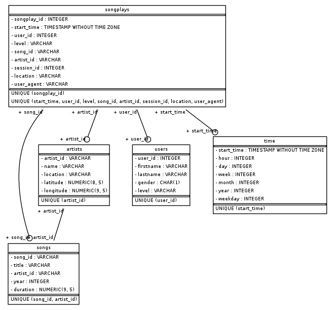

# Sparkify ETL
## Project description 
Learning project for Udacity DE Nanodegree.  The code will built a db in postgress and populate it by reading, wranging logfiles and importing the reulting dataframes into postgress.

## Database design: 
A star schema is used to allow detailed analytical queries to be run against the data.  See also the ER diagram below showing the relationships between the tables,

### songplays
Fact table holding data about each songplay

### songs
Dimension table holding data about each song - with a foreign key to get information about the artist who sang the song

### artists
Dimension table holding data about each artist

### users
Dimension table holding data about the __current status__ of each each user

### time
Dimenstion data holding data about each timestamp

## ETL Process: 
### Song and artist data import
Song and artist data is imported from json files /home/workspace/data/song_data

For each of song and artist
- Each file is read and the appropriate data appended to a dataframe
- Some limited wrangling is performed on the df (duplicates are removed and some datatypes are changed)
- The df is exported as a csv 
- The csv is imported into the postgres table using the Postgress COPY command
- The csv is dropped

### Log data import
User, time and songplay data is imported from line delimited json files in /home/workspace/data/log_data

- Each file is read and the data appended to a log_data dataframe
- A time df is created, wrangled, exported as a csv and imported into Postgres using COPY 
    - For the time data this also involves the derivation of time features from the timestamp (day_of_week, month, etc)
- A user df is created, wrangled, exported as a csv and imported into Postgres using COPY
- The csv are dropped

### Songplay data import
The songplay data is generated by merging the song and artist data with the log data
- The song and artist data is joined using `song_select` and a dataframe created
- The dataframe is merge with the log_data dataframe created earlier
- The resulting songplay dataframe is wrangled, exported as a csv and imported into Postgres using COPY

## Project Repository files
- `create_tables.py` - Code to drop (if necessary) and build a Postgres db to contain Sparkify song and log data
- `etl.py` - Code to read Sparkify song data and log data from the data directory and and read it into a a postgres database
- `sql_queries.py` - contains the various SQL strings used by the code

## How To Run the Project
1. Run create_tables.py to drop (if necessary) and build a Postgres db to contain Sparkify song and log data
2. Run etl.py to read Sparkify song data and log data from the data directory and and read it into a a postgres database

## Assoc files
- The data folder contains the log and song json files.
- The tmp folder is used to hold the temporary csv files that are copied directly into Postgres.
- The dev folder contains various files used during development.
- The img folder contains images used in the readme.
