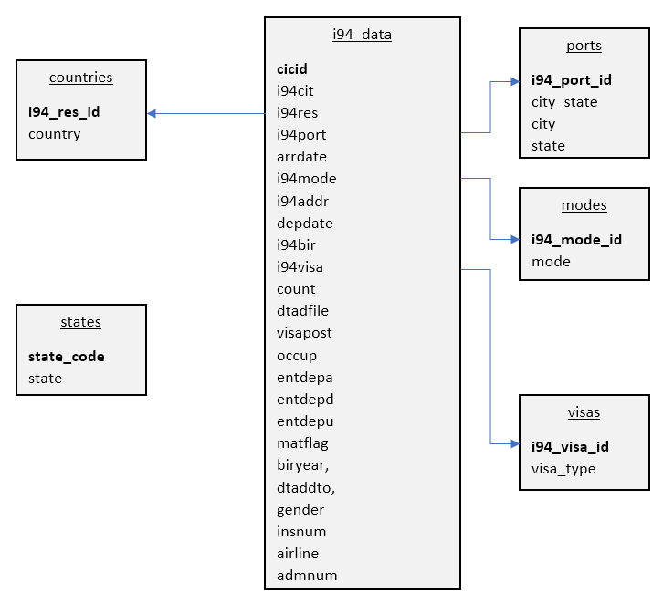

# Capstone Project

## TL/DR - just get me started

### Initial run
`$> python main.py`

This runs through all the steps
- Clean the data
- Save the cleaned data locally
- Upload the data to S3
- Create database
- Ingest the data from S3 
Once complete open the database in Redshift and run queries

To end the session and pause the redshift database

`$> python pause_cluster.py`

### Subsequent runs
`$> python start_cluster.py`

Once complete open the database in Redshift and run queries

To end the session and pause the redshift database

`$> python pause_cluster.py`

### To drop the databse entirely
This functionality is provided but is unlikely to be needed 

`$> python delete_cluster.py`

----
## Rationale

Ingest of I94 immigration data to a set of tables in a Redshift database for analytical purposes.  The (imaginary) use case requires the user to be able to analyse immigration data on an adhoc basis - with a focus on particular ports of entry.  It is envisaged that the users will interact with the data using Redshift.

## Approach

A combination of Spark and SQL was use for this project; the data is staged on S3 and stored in a Redshift database.

- I chose to use pySpark as Spark allows scalablility - at present the Spark code runs locally but should we we wish to scale this up Spark is very well suited.
- I chose SQL for the DB work as it is the simplest tool for the job and is well understood allowing for maintainability.
- I chose S3 as it was the only viable option for cheap, scalable cloud storage in the environment I was working in.
- I chose Redshift as it provides a scalable relational database which is ideal for he user case I have in mind - ad-hoc queries for analytical work

### Other scenarios

#### Data increased by 100x
In this case the follwiing steps could be taken
- Create an EMR envoronment and run the spark code in the cloud
- Save the cleaned data directly to S3
- Increase the size of the Redshift cluster
- Optimise the database of for the most commonly run queries (possibly using a nosql environment such as Cassandra)

#### Pipelines run at 7am daily
In this case the code could be scheduled in an Airtlof job, it was written with this in mind and would not need significant rework.

#### The database needs to be accessed by 100+ people
Redshift should be able to handle this but the following steps could be taken
- Increase the size of the Redshift cluster
- Optimise the database of for the most commonly run queries (possibly using a nosql environment such as Cassandra)
- If numbers grew further we could implement [Amazon Redshift Concurrency Scaling](https://aws.amazon.com/redshift/features/concurrency-scaling/)

## Data Exploration
See detail in the ata Cleaning section below

## Design

### Cleaning
The data is clean using pySpark a set of pySaprk modules whch read the source data into dataframes and wrangle it.  These are run locally - this decisiosn was taken as it was quicker and easier to implement and doe not incur compute costs.

The cleaned data is written back to the local filesystem as either parquet files (immigration data) or csv files (dimention data).

### S3 buckets

The S3 bucket is created via boto3.

### Data upload

The data is uploaded from the local filesystem to the S3 bucket to using Spark.

### Database design

A star schema is used for the database with the immigration data held in the fact table and various dimension tables  joined to it via foreign keys.

#### ER diagram

#### Data Dictionary
See the data dicitonary [here](https://github.com/stovepilot/udacity_nano/blob/capstone/project/data_dictionary.md#data-dictionary)

## Data Wrangling
### Immigration Data
#### Null values
There are multiple NULL values throughout the dataset but these have been left unchagned as they are categorical data fields - interpolating data to fill them would not be a valid approach

#### Arrival and Departure dates
Arrival and departure dates are held in SAS format - these are converted to datetime fields

#### Additional columns in the Jun datafile
Four additional features are present in the June data.  These were all NULL so the features have been dropped.

### Airport data
The most obvious source of the airport data is the airport_codes_cvs.csv file.  However, though the data is of good quality investigations showed that it is incomplete.  On that basis the SAS label file was used.

## DQ

I have included two data quailty checks.  Thsi first compares the number of parquet files on the local system with the number uploaded and checks that they match.  The second checks the row counts from the raw data against the fact table in redshift.

## Code

#### aws.cfg
Contains all cofiguration settings apart from the aws credentials, which are held separately

### Wrangling
#### clean_data.py
Contains functions to clean the data and write it back to a location set in the config file (currently the local filesystem).

### Data Upload
#### upload_data.py
A set of functions to create the s3 bucket (only ever run once) and upload the data from the local filesystem, to s3.  This latter code would be run for each monthly/daily dataset for the job were to be scheduled.

### Redshift tools
#### redshift.py
A set of functions which allow the redshift cluster to be spun up, paused, restarted or deleted entirely whcih configuration based on the config file.

### ETL 
#### etl.py
A set of functions used to create and populate the database on the redshift cluster.  The SQL called by the functions is held separately

#### sql_queries.py
The sql called by the fucntions on etl.py

### User control code
The followling code is designed to be called by the user to perform the various tasks (and could indeed be called from a tool like airflow).

#### main.py
`> python main.py`

Runs through all the steps
- Clean the data
- Save the cleaned data locally
- Upload the data to S3
- Create database
- Ingest the data from S3

#### start_cluster.py
`> python start_cluster.py`

Starts the cluster
- If a saved snapshot exists 
    - resuming from a saved snapshot 
- If no snapshot exists
    - creating a new cluster
    - running the DDL to build an empty DB
    - Ingesting the data from S3

#### pause_cluster.py
`> python start_cluster.py`

Stops the cluster and saves a snapshot of the database

#### delete_cluster.py
`> python delete_cluster.py`

Stops the cluster without saving a snapshot

